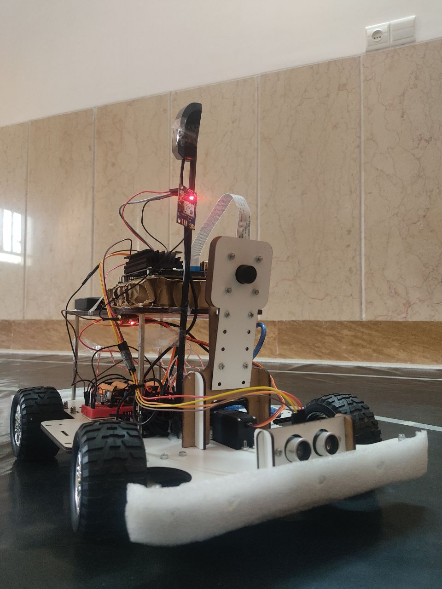

# Neo Pilot E2E (End-to-end)
---

Design and development of an End to End lane follower AI. Successfully implemented on Jetson Nano and tested on a test track.

Jetson Nano. The main processor:

A picture of the car itself:

Test on the test track:
